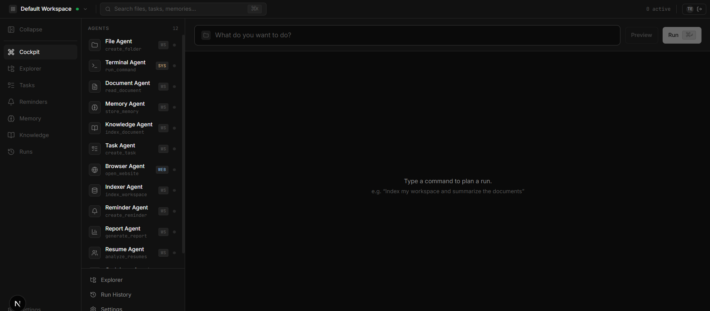
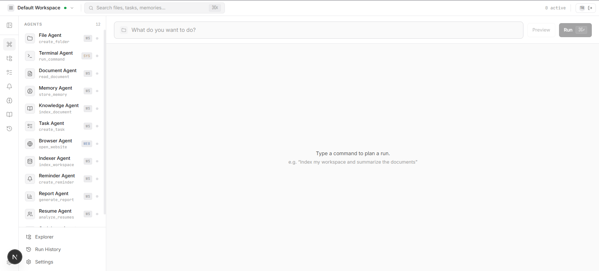
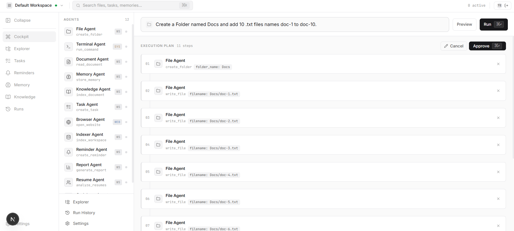
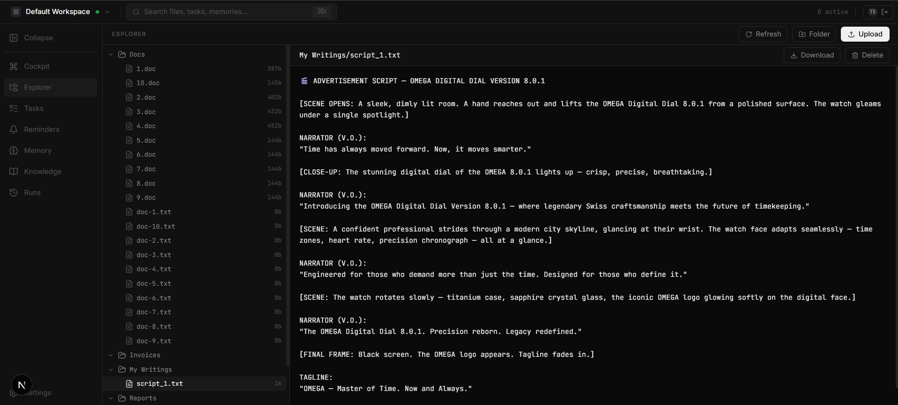
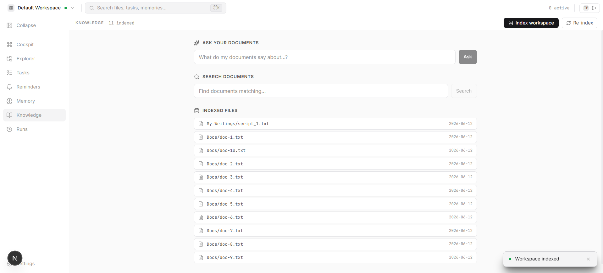
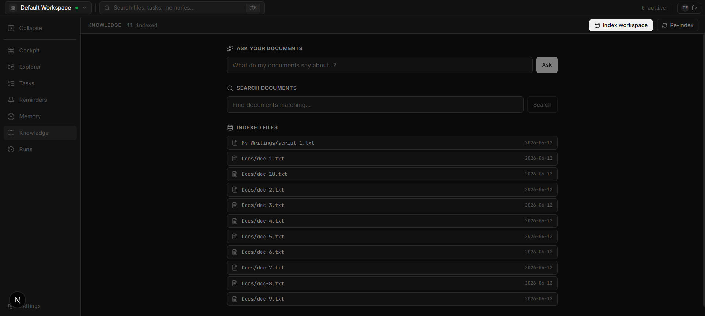

# Workspace OS — an Agentic Software OS

A personal, multi-tenant **operating system for AI agents**. You own several isolated
**workspaces** (think *"This PC"* with separate drives — one per project), import files,
folders or whole codebases into them, and issue natural-language requests. A visible
team of **12 specialist agents** carries them out through a **plan → approve → execute**
loop, streaming each step live.

It is deliberately **not a hidden chatbot**: the agents, their steps and their outputs
are all first-class, visible and controllable — a *mission-control cockpit for a team of
AI workers.*

---

## Screenshots

### The Cockpit — agent roster + command bar
The hero screen: all 12 agents live in the left rail with scope badges (WS / WEB / SYS),
and a single command bar drives everything. Ships with both dark and light themes.




### Plan → approve → execute
A natural-language request first becomes an **editable plan** — an ordered list of agent
steps (here, *"Create a folder named Docs and add 10 .txt files"* expands into an
11-step plan). Approve, edit or cancel before anything runs.



### Workspace Explorer + document viewer
Browse the workspace file tree and read file contents inline.



### Knowledge / Indexer dashboard
Ask questions across indexed documents (RAG), search by topic with relevance scoring,
and see exactly what's indexed — with one-click *Index workspace* / *Re-index*.




---

## What it does

- **Multi-workspace.** Every file, task, reminder, memory, index and run is scoped to
  `(user, workspace)`. Switching workspaces re-scopes everything. On disk each workspace
  is isolated (`workspaces/{id}/`); in the vector store each gets its own namespace.
- **A team of 12 agents (and more to come).** File, Terminal, Document, Memory,
  Knowledge (RAG), Task, Browser, Indexer, Reminder, Report, Resume and Codebase agents —
  each with a scope (workspace / web / system) and a set of actions. The roster is
  designed to grow. See [docs/AGENTS.md](docs/AGENTS.md).
- **Plan → approve → execute.** A request first produces an editable **plan** (steps =
  agent + action + params, with data flowing between steps). You approve/edit, then it
  executes — streaming live over SSE into a React Flow step graph.
- **Dashboards & explorer.** Tasks, reminders/daily-briefing, memory, knowledge/indexer
  status, a drag-drop file explorer with zip/folder import + auto-index, run history
  replay, and one-click direct-agent buttons.

---

## 🌱 The roster (and who's next)

**12 agents are on payroll today** — and the architecture is built so adding the next
one is a weekend, not a rewrite. Each agent is just a self-contained folder
(`backend/src/agents/<name>_agent/`) with an executor + service, registered once in the
[manifest](backend/src/agents/manifest.py). Drop in a new folder, list its actions, and
it automatically shows up in the planner, the `GET /api/agents` manifest, and the
cockpit's agent roster.

Currently clocked in: **File · Terminal · Document · Memory · Knowledge · Task · Browser
· Indexer · Reminder · Report · Resume · Codebase.**

On the hiring board (ideas welcome — open a PR): an Email agent, a Calendar agent, a
Git/PR agent, an Image/OCR agent… the roster is hiring. 🤖✨

---

## Architecture at a glance

```
Browser (Next.js cockpit) ──JWT──► FastAPI (REST + SSE)
                                      │
                                      ▼
                          LangGraph orchestration
                          planner → router → response
                                      │
                                      ▼
                            12 agent executors
                          │           │            │
                        SQL DB     Pinecone     Workspace disk
                                  (RAG+memory)  workspaces/{id}/
```

| Layer | Tech | Where |
|-------|------|-------|
| Frontend | Next.js 16, React 19, TypeScript, Tailwind v4, TanStack Query, Zustand, React Flow | [frontend/](frontend/) |
| Backend | FastAPI, LangGraph, SQLAlchemy | [backend/](backend/) |
| LLMs | Anthropic Claude / OpenAI / OpenRouter | [backend/src/core/llm/](backend/src/core/llm/) |
| Vector store | Pinecone (+ Cohere reranking) | [backend/src/core/vectorstore/](backend/src/core/vectorstore/) |

Full detail in the docs:

- **[docs/ARCHITECTURE.md](docs/ARCHITECTURE.md)** — backend, the orchestration graph,
  data model, full API surface, configuration.
- **[docs/AGENTS.md](docs/AGENTS.md)** — the 12 agents, their scopes and every action.
- **[docs/FRONTEND.md](docs/FRONTEND.md)** — the cockpit, workspace UI, live run panel,
  dashboards and per-agent result cards.

---

## 🛸 So you want to run this thing

Welcome, brave dev. You're about to hire **12 AI agents** (and
[more are on the way](#-the-roster-and-whos-next) — the roster is hiring). They don't
need coffee, they don't take PTO, and they only ask for a few API keys. Let's get them
clocked in.

### Step 0 — abduct the repo

```bash
git clone <this-repo-url> agentic-software-os
cd agentic-software-os
```

### Step 1 — feed it secrets 🔑

The backend runs on environment variables the way agents run on ambition. Drop a
`backend/.env` file and fill it in (see the [Configuration](#configuration) table for
what each one does):

```bash
# backend/.env  — the minimum to wake the agents up
APP_NAME="Workspace OS"
DATABASE_URL="sqlite:///./app.db"
JWT_SECRET_KEY="change-me-to-something-spicy"
JWT_ALGORITHM="HS256"
ACCESS_TOKEN_EXPIRE_MINUTES=10080
ANTHROPIC_API_KEY="sk-ant-..."
MODEL_NAME="claude-sonnet-4-6"
OPENROUTER_API_KEY="..."
OPENROUTER_MODEL="..."
COHERE_API_KEY="..."
PINECONE_API_KEY="..."
PINECONE_INDEX_NAME="workspace-os"
WORKSPACE_DIR="workspace"
WORKSPACES_ROOT="workspaces"
CORS_ORIGINS="http://localhost:3000,http://127.0.0.1:3000"
```

> 🤫 No, we will not commit this file. `.env` stays between you and your agents.

### Step 2 — press the big red button 🚀

```bash
docker compose up --build
```

Now go make a sandwich. When you're back:

- 🖥️  **Cockpit (frontend)** → http://localhost:3000
- 🧠 **API (backend)** → http://localhost:8000 · docs at http://localhost:8000/docs

### Step 3 — boss them around 🫡

1. Register an account, then create your first **workspace** ("This PC", but cooler).
2. Drag some files in. Watch the Indexer Agent earn its keep.
3. Type something into the command bar — *"index my workspace and summarize the docs"* —
   hit **Preview**, admire the plan, then **Approve** and watch the agents light up.

That's it. You're now middle management for a team of robots. 🎉

> Prefer doing it by hand (no Docker)? The fully manual, no-magic version lives in
> [Quick start (local dev)](#quick-start-local-dev) below.

---

## Quick start (Docker)

The fastest way to run the whole stack:

```bash
# 1. Provide backend secrets
cp backend/.env.example backend/.env   # then fill in keys (or create backend/.env)

# 2. Build and run backend + frontend
docker compose up --build
```

- Frontend → http://localhost:3000
- Backend  → http://localhost:8000  (API docs at http://localhost:8000/docs)

> The frontend talks to the backend from the **browser**, so `NEXT_PUBLIC_API_URL`
> points at the host-published backend port (`http://localhost:8000` in compose).

---

## Quick start (local dev)

### Backend

```bash
cd backend
python -m venv venv && source venv/bin/activate   # Windows: venv\Scripts\activate
pip install -r requirements.txt
# create backend/.env (see the table below), then:
uvicorn src.main:app --reload --port 8001
```

### Frontend

```bash
cd frontend
npm install
npm run dev        # http://localhost:3000
```

Point the frontend at the backend in `frontend/.env.local`:

```
NEXT_PUBLIC_API_URL=http://localhost:8001
```

---

## Configuration

Backend reads `backend/.env` (see
[settings.py](backend/src/core/config/settings.py)):

| Var | Purpose |
|-----|---------|
| `APP_NAME` | App title |
| `DATABASE_URL` | SQLAlchemy connection string |
| `JWT_SECRET_KEY`, `JWT_ALGORITHM`, `ACCESS_TOKEN_EXPIRE_MINUTES` | Auth |
| `ANTHROPIC_API_KEY`, `MODEL_NAME` | Claude |
| `OPENROUTER_API_KEY`, `OPENROUTER_MODEL` | OpenRouter |
| `COHERE_API_KEY` | Reranking |
| `PINECONE_API_KEY`, `PINECONE_INDEX_NAME` | Vector store |
| `WORKSPACE_DIR`, `WORKSPACES_ROOT` | Disk layout |
| `CORS_ORIGINS` | Comma-separated allowed origins (default `http://localhost:3000`) |

Frontend: `NEXT_PUBLIC_API_URL` in `frontend/.env.local`.

---

## API surface (summary)

`auth/*` · `me` · `workspaces` CRUD · `files` (list/read/upload/download/delete) ·
`chat` · `chat/stream` (SSE) · `plan` · `run` · `agents` · `agents/{name}/run` ·
`tasks` CRUD · `reminders` (+`due`, +`daily-summary`) · `knowledge`
(status/search/index) · `memories` (list/delete) · `dashboard` · `search` · `runs`.

Every response is the envelope `{ success, data, error }`; auth is JWT bearer; the
active workspace travels as `workspace_id`. Details in
[docs/ARCHITECTURE.md](docs/ARCHITECTURE.md#5-api-surface).

---

## Repository layout

```
backend/    FastAPI app — api/ graph/ agents/ core/ workspaces/ prompts/
frontend/   Next.js cockpit — app/ components/ hooks/ lib/ stores/
docs/       ARCHITECTURE.md · AGENTS.md · FRONTEND.md
docker-compose.yaml
```
